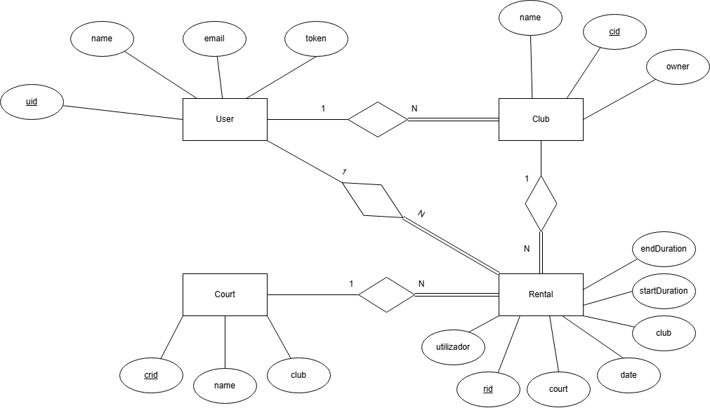
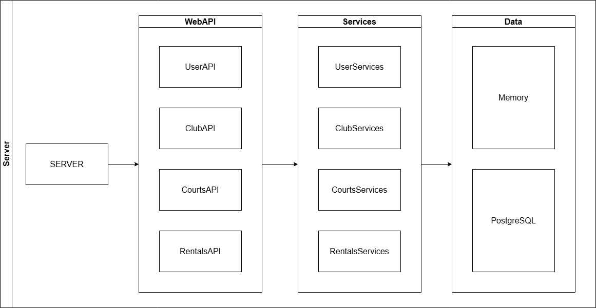
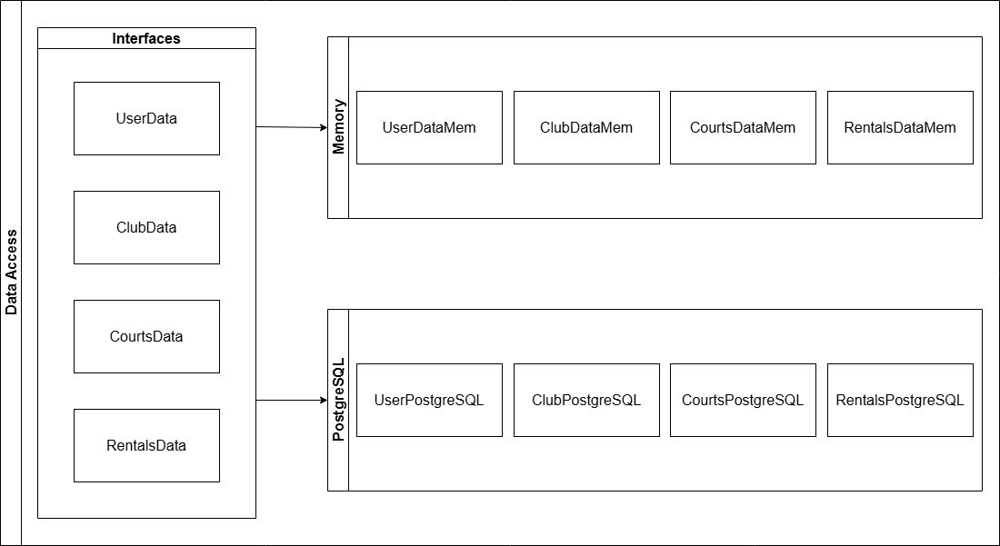

# Relatório do Projeto LS - Fase 1, Fase 2, Fase 3 & Fase 4

## Introdução
Este documento contém os aspectos relevantes de design e implementação da primeira fase do projeto LS.
É de se revelar que para o funcionamento deste trabalho foram utilizadas variáveis de ambiente, sendo elas `JDBC_DATABASE_URL`, 
que define o url para a base de dados, e `DATA_TYPE` que define a base de dados a utilizar, sendo que o valor `LOCAL` refere-se à base de dados em memória 
e o valor `POSTGRES` refere-se à base de dados em Postgres.
Na fase 2, foram adicionadas novas funcionalidades, como a possibilidade de atualizar e eliminar rentals, além da implementação de uma Single Page Application (SPA).

Na fase 3, foram adicionadas novas operações, melhorias na interface da aplicação web e refatoração do código para melhorar a qualidade e cobertura de testes.

Na Fase 4, foram implementadas diversas melhorias tanto no código Kotlin quanto no JavaScript. Adicionámos funcionalidades importantes, 
como a possibilidade de iniciar sessão (kotlin e javascript), criar um utilizador (javascript) e terminar sessão (kotlin e javascrip). 
Além disso, foram realizadas melhorias na interface da aplicação web, tornando-a mais intuitiva e agradável para o utilizador. 
Por fim, a aplicação passou a estar hospedada na plataforma Render, facilitando o seu acesso e disponibilidade online.

## Modelagem do Banco de Dados

### Modelo Conceitual

O diagrama a seguir contém o modelo Entidade-Relacionamento para as informações gerenciadas pelo sistema.



Destacamos os seguintes aspectos:
O modelo possuiu 4 entidades: User, Club, Court e Rental, com cada uma possuindo chaves primárias e atributos relevantes.
- User -> possui como chave primária o uid (serial) outros 3 atributos varchar: name, email e token.
- Club -> possui como chave primária o cid (serial) e outros 2 atributos: name(varchar) e owner(int), sendo onwer uma chave estrangeira para o uid do User.
- Court -> possui como chave primária o crid (serial) e outros 2 atributos: name(varchar) e club(int), sendo club uma chave estrangeira para o cid do Club.
- Rental -> possui como chave primária o rid (serial) e outros 6 atributos: startDuration, endDuration, utilizador, court e club, todos do tipo int, e 
date (date), sendo utilizador, court e club chaves estrangeiras para uid (User), crid (Court) e cid (Club), respectivamente.

O modelo conceitual possui as seguintes restrições:
- User:
  - Não possuiu restrições relevantes
- Club:
  - Um clube tem obrigatoriamente um nome.
  - Um clube tem obrigatoriamente um dono (owner).
- Court:
  - Novos courts só podem ser criados se pertencerem a um clube existente e cada court tem de ser nomeado.
- Rental:
  - Um rental só pode ser criado caso exista um court e um club, e esse court pertencer ao club, uma data válida, no futuro, e dentro de um horário disponível.
- Outras observações:
  - Todas os atributos que são chaves primárias devem ser sempre valores positivos.

### Modelo Físico

O modelo físico do banco de dados está disponível em [link para o script SQL com a definição do esquema](../src/main/sql/createDomainSchema.sql).

Destacamos os seguintes aspectos deste modelo:
- No enunciado mostra que para o rental temos de ter um duration, para saber quanto tempo dura o rental. Para isso decidimos separar em
startDuration, que diz a hora a que começa e endDuration, que nos informa quando acaba o rental.
- A tabela User faz a verificação de que o email contém um '@'

## Organização do Software

### Especificação Open-API
A especificação Open-API está disponível em [link para o arquivo YAML contendo a especificação Open-API](./spec.yaml).
- Fase 2: 
  - A especificação Open-API foi atualizada para incluir os novos endpoints de atualização e eliminação de rentals.
- Fase 3:
  - Foi adicionada uma operação para buscar clubes por nome, com suporte a nomes parciais.
- Fase 4:
  - Foi adicionado o login do utilizador. Ainda retiramos o "/api" do iníco, uma vez que já não usamos o prefixo "/api" nas rotas da aplicação web.

Na nossa especificação Open-API, destacamos os seguintes aspectos:
- Todas as operações estão documentadas.
- A maneira como os parâmetros são passados para cada operação.
- Possíveis erros que podem ocorrer em cada operação.

### Detalhes da Requisição
Para ajudar a compreender melhor a nossa implementação fizemos este diagrama que representa a forma como as requisições são tratadas no servidor.



Todas as requisições são recebidas por um ficheiro server que divide as requisições pelo seu próprio URL para a API correspondente.
Todas as API's estão relacionadas com a entidade que está a ser utilizada no momento. Como exemplo, se queremos criar um novo clube, esse pedido é enviado para
o ficheiro da API dos clubes.

A API de cada entidade é responsável por receber o pedido, efetuar a operação correspondente, enviado-a para os Serviços.
A informação enviada para os Serviços pode estar no cabeçalho ou no corpo do pedido, dependendo do tipo de operação que está a ser realizada.
Nesta secção, enviamos as repostas HTTP para o cliente e tratamos das respostas recebidas dos Serviços.

Na secção de Serviços, encontra-se a lógica de verificação de parâmetros de cada operação que é feita e por fim enviamos o pedido para a secção de Dados.
Nesta secção, verificamos se o utilizador que está a fazer os pedidos é um utilizador que consta na base de dados (em memória ou Postgres), ou seja, verificamos se o token que está
no cabeçalho do pedido é válido. Esta operação é feita em operações de criação que envolva um utilizador para poder criar.
Além disto, fazemos a verificação dos parâmetros que estão a ser enviados para o serviço, se são válidos ou não. Caso não sejam válidos, enviamos
uma exceção para a API, que irá enviar uma resposta HTTP 400 com um código de erro a avisar para o cliente o que está de errado com o pedido efetuado.
Se não houver erros, enviamos o pedido para a secção de Dados.

Na secção de Dados, encontra-se a implementação de cada entidade, ou seja, é aqui que são feitas as operações que o cliente pediu.
Nesta secção, modificamos a base de dados, seja ela em memória ou Postgres. É aqui onde podemos criar utilizadores, clubes, courts e rentals ou podemos receber informações
sobre os utilizadores, clubes, courts e rentals que estejam na base de dados. Na criação de um novo utilizador, clube, court ou rental, fazemos verificações para 
assegurar que o utilizador, clube ou court que está a ser criado já não existam na base de dados. Caso contrário, enviamos uma exceção para a API. Ainda fazemos outras
verificações para garantir que o utilizador está a fazer bem o pedido, como por exemplo, se para o rental que está a ser criado, o court e o clube associados estão ligados entre si.

#### Fase 2:

Com a adição das novas funcionalidades, o fluxo de requisições foi ajustado para incluir as operações de atualização e eliminação de rentals.

#### Fase 3:

Nesta fase, o fluxo foi ajustado para incluir a operação de busca de clubes por nome. Além disso, foram feitas melhorias na interface da aplicação web para suportar as novas funcionalidades.

### Gerenciamento de Conexões
Todas as secções do projeto estão ligadas entre si, ou seja, usámos o método de injeção de dependências para que cada secção tenha acesso à anterior. Por outras palavras, 
para que cada API funcione, ela tem de ter acesso a um ou mais serviços e, por conseguinte, os serviços têm de ter acesso à secção de dados correspondente.
No ficheiro do servidor, criamos uma instância da base de dados e conectamo-la ao serviço correspondente e, por fim, ligamos o serviço à API correspondente.
Em baixo encontra-se um exemplo de como é feita a ligação entre as secções:

```kotlin
private val usersData = when(System.getenv("DATA_TYPE")) {
    "LOCAL" -> userDataMem()
    "POSTGRES" -> userPostgresSQL()
    else -> throw IllegalArgumentException("Invalid data type")
}
private val usersServices = userServices(usersData)
val userWebApi = userWebApi(usersServices)
```
Para fazer uso da base de dados em Postgres, fizemos uso das melhores práticas. Obtemos instâncias de `Connection` através da
interface `DataSource`. No acesso à base de dados, usamos a função de extensão `use` que garante que após o uso da conexão, ela é fechada.
Dentro de cada bloco de código, desabilitamos o autocommit, para garantir que caso exista um erro, a transação não é feita e podemos reverter as alterações,
fazendo uso da função `rollback`. Caso não haja erros, fazemos commit da transação.

### Acesso a Dados
No acesso a dados, fizemos uso de interfaces para garantir que o acesso à base de dados em memória e a base de dados em Postgres são feitos da mesma forma.
Em baixo encontra-se um esquema que resume a forma como o acesso a dados é feito:



Como podemos ver pela imagem, estas interfaces são utilizadas para a ajudar a implementar o acesso a dados, quer seja em memória ou em Postgres. 
Assim, conseguimos garantir que o acesso a dados é feito da mesma forma, independentemente de qual base de dados estamos a usar.

No ficheiro que foi mencionado anteriormente na [secção do modelo físico](#modelo-físico), temos vários atributos que são `Unique`, ou seja, não podem existir dois valores iguais,
preservando assim a integridade da base de dados. Estes atributos são:
- User: email, token
- Club: name
- Court: name e club ao mesmo tempo
- Observações:
  - Para explicar melhor a situação do court, nós podemos ter courts que partilham o mesmo nome, mas que sejam de clubs diferentes.
  Então, para isso, decidimos fazer um `Unique` de name e club ao mesmo tempo.

Ainda fazemos uso da restrição `CHECK` do Postgres, que verifica se o email contém um '@'. Assim, garantimos que o email é válido.

### Tratamento/Processamento de Erros

Para o tratamento de erros, optámos por criar um enumerado com os erros possíveis de ocorrer, onde cada erro possui um código e uma descrição associada, permitindo que o cliente compreenda o que está a acontecer. 
Além disso, temos uma data class `AppError` que recebe um código de erro (`code`) e os detalhes do erro (`details`), lançando uma exceção correspondente.

Dentro de cada função de cada API, fazemos uso do `try-catch` para garantir que, caso ocorra um erro, o sistema trata da exceção. Quando occore essa exceção,
chamamos a função `errorToHttp` que é responsável por mapear o erro para o código de erro e a descrição adequados e devolver a resposta HTTP correspondente.

## Avaliação Crítica

### Fase 1

Para esta primeira fase do projeto, todas as funcionalidades propostas foram implementadas com sucesso, contudo, melhorias poderiam ser feitas caso encontremos
formas e justificativas para o melhoramento e/ou exista necessidade para tal.

### Fase 2

Para esta segunda fase, o projeto evoluiu significativamente, oferecendo funcionalidades mais completas.
Conforme dito na [avaliação crítica da fase 1](#fase-1), foram feitas algumas melhorias ao código.
Todas as funcionalidades propostas foram implementadas com sucesso, contudo, melhorias podem ser feitas caso encontremos
formas e justificativas para o melhoramento e/ou exista necessidade para tal.

### Fase 3

Na terceira fase, o projeto alcançou um nível de maturidade maior, com a adição de novas operações e melhorias na interface da aplicação web.
No entanto, ainda há espaço para melhorias caso encontremos formas e justificativas para tal.

### Fase 4

Na quarta fase, o projeto foi aprimorado com a adição de funcionalidades de autenticação e melhorias na interface da aplicação web.
Todas as funcionalidades propostas foram implementadas com sucesso e a aplicação foi hospedada na plataforma Render, tornando-a mais acessível.
Com isto, o projeto alcançou um nível de maturidade significativo e uma experiência de utilizador mais completa.
No entanto, ainda há espaço para melhorias caso encontremos formas e justificativas para tal.
